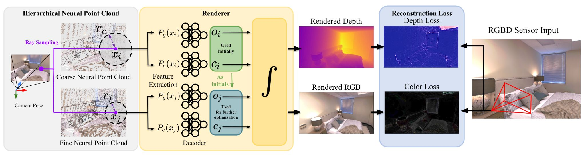
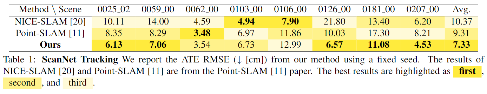
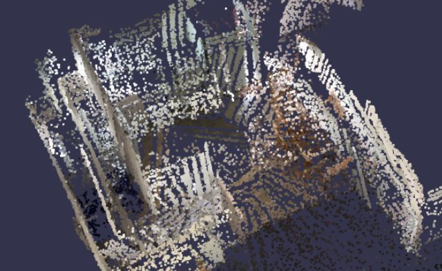
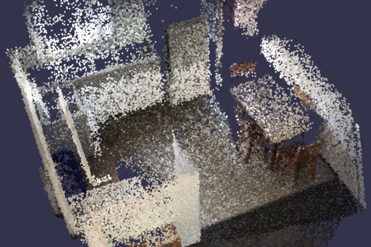

<p align="center">
  <h1 align="center">Hierarchical Dense Neural Point Cloud-based SLAM</h1>
  <p align="center">
    <a href="https://github.com/Liux1n"><strong>Liuxin Qing*</strong></a>
    ·
    <a href="https://github.com/DecAd3"><strong>Longteng Duan*</strong></a>
    ·
    <a href="https://github.com/guo-han"><strong>Guo Han*</strong></a>
    ·
    <a href="https://github.com/cs-vision"><strong>Shi Chen*</strong></a>
  </p>
  <p align="center"><strong>(* Equal Contribution)</strong></p>
  <h3 align="center"><a href="https://github.com/guo-han/Hierarchical-Point-SLAM/tree/main/documents/poster.pdf">Poster</a> | <a href="https://github.com/guo-han/Hierarchical-Point-SLAM/tree/main/documents/report.pdf">Report</a></h3>
  <div align="center"></div>
</p>
<p align="center">
  <a href="">
    
  </a>
</p>
<p align="center">
The pipeline of hierarchical Point-SLAM
</p>
<p align="center">
    <ul>
        <li>A coarse-to-fine hierarchical neural point cloud with different dynamic sampling radius.</li>
        <li>In mapping: optimize the neural features in coarse and fine point clouds independently.</li>
        <li>In tracking: begin by optimizing camera pose using coarse-level features, and subsequently integrate fine-level features for more refined enhancements.</li>
        <li>Our results are shown below.</li>
    </ul>
</p>

<p align="center">
  <a href="">
    
  </a>
</p>


<div align = "center">
  
</div>

<p align="center">
A comparison of the resulting neural point cloud
taken from ScanNet scene 0181 at the frame 2438. <br>
Left: master. Right: Ours.
</p>

<details open="open" style='padding: 10px; border-radius:5px 30px 30px 5px; border-style: solid; border-width: 1px;'>
  <summary>Table of Contents</summary>
  <ol>
    <li>
      <a href="#environment-setup">Environment Setup</a>
    </li>
    <li>
      <a href="#dataset">Dataset</a>
    </li>
    <li>
      <a href="#configs">Configs</a>
    </li>
    <li>
      <a href="#run">Run</a>
    </li>
    <li>
      <a href="#acknowledgement">Acknowledgement</a>
    </li>
  </ol>
</details>

## Environment Setup
One can create an anaconda environment called `point-slam`.
```
conda env create -f env.yaml
conda activate point-slam
```
To evaluate F-score, please install [this](https://github.com/tfy14esa/evaluate_3d_reconstruction_lib) library.
```
git clone https://github.com/tfy14esa/evaluate_3d_reconstruction_lib.git
cd evaluate_3d_reconstruction_lib
pip install .
```
### Set Environment on ETH Euler Cluster
```
module load StdEnv mesa/18.3.6 cudnn/8.2.1.32 python_gpu/3.10.4 eth_proxy hdf5/1.10.1 gcc/8.2.0 openblas/0.3.15 nccl/2.11.4-1 cuda/11.3.1 pigz/2.4 cmake/3.25.0
cd $SCRATCH
git clone git@github.com:guo-han/Hierarchical-Point-SLAM.git
cd $SCRATCH/Hierarchical-Point-SLAM
conda env create -f env.yaml python=3.10.4
conda activate point-slam
cd $SCRATCH
mkdir ext_lib
cd ext_lib
git clone --recursive https://github.com/intel-isl/Open3D
cd Open3D
git checkout tags/v0.9.0
git describe --tags --abbrev=0
git submodule update --init --recursive
mkdir build
cd build
cmake -DENABLE_HEADLESS_RENDERING=ON -DBUILD_GUI=OFF -DBUILD_WEBRTC=OFF -DUSE_SYSTEM_GLEW=OFF -DUSE_SYSTEM_GLFW=OFF -DPYTHON_EXECUTABLE=/cluster/home/guohan/miniconda3/envs/point-slam/bin/python ..   # Remember to change the `DPYTHON_EXECUTABLE`
make -j$(nproc)
make install-pip-package
cd ../..
git clone https://github.com/tfy14esa/evaluate_3d_reconstruction_lib.git
cd evaluate_3d_reconstruction_lib
pip install .
```
More information about installing [Open3D](https://gist.github.com/kev-in-ta/372c8451b172d309b7998362597a1456) and [evaluate_3d_reconstruction_lib](https://github.com/tfy14esa/evaluate_3d_reconstruction_lib).
## Dataset 

### ScanNet
Please follow the data downloading procedure on the [ScanNet](http://www.scan-net.org/) website, and extract color/depth frames from the `.sens` file using this [code](https://github.com/ScanNet/ScanNet/blob/master/SensReader/python/reader.py).

<details>
  <summary>[Directory structure of ScanNet (click to expand)]</summary>
  
  DATAROOT is `./Datasets` by default. If a sequence (`sceneXXXX_XX`) is stored in other places, please change the `input_folder` path in the config file or in the command line.

```
  DATAROOT
  └── scannet
      └── scans
          └── scene0000_00
              └── frames
                  ├── color
                  │   ├── 0.jpg
                  │   ├── 1.jpg
                  │   ├── ...
                  │   └── ...
                  ├── depth
                  │   ├── 0.png
                  │   ├── 1.png
                  │   ├── ...
                  │   └── ...
                  ├── intrinsic
                  └── pose
                      ├── 0.txt
                      ├── 1.txt
                      ├── ...
                      └── ...

```
</details>


We use the scene 0181 in ScanNet as demo: 
```
scene0181
```
## Configs
All configs can be found under the `./configs` folder.
### ScanNet Dataset Configurations:

- Open the `./configs/ScanNet/scenexxxx.yaml` files.
- Check and modify the `data/input_folder` path in configuration files according to your dataset location.
### wandb (Weights and Biases) Integration:

- In the `./configs/point_slam.yaml` file, set the `wandb_dir` variable to your own path.
- Ensure that the specified path exists and is accessible.
### Modifying Coarse Level Radius Values for Testing:

- In the `./configs/ScanNet/scannet.yaml` file, locate the variables:
  - `pointcloud/radius_hierarchy/mid/radius_add_max`
  - `pointcloud/radius_hierarchy/mid/radius_add_min`
- Adjust the values of these variables to experiment with different coarse level radius values.
### Mapping and Tracking Iterations:

- To change the number of iterations for mapping and tracking, refer to the variables:
  - `tracking/iters`
  - `mapping/iters`
- Note that these variables control the total number of iterations for both levels. The default ratio of iteration division between the two levels is 0.5. If you want to modify the mapping iteration ratio for the middle level specifically, check the variable `mapping/mid_iter_ratio` in `./configs/point_slam.yaml`.
### Variable Overwriting and Caution:

- Take into account that the settings specified in `point_slam.yaml` will be overwritten by those in `scannet.yaml` if they share the same key values.
- Exercise caution when modifying variables to ensure that you are changing the intended ones.
## Run
To run on the ScanNet, for example, scene0181, use the following command,
```
python run.py configs/ScanNet/scene0181.yaml
```
### Run on Euler Cluster
Please remember to modify the `--output`, `--error`, `source [conda env path]`, `output_affix`, etc. inside `repro_demo.sh`, as well as the `wandb_dir` in `configs/ScanNet/point_slam.yaml`
```
cd $SCRATCH/Hierarchical-Point-SLAM
sbatch repro_euler.sh   # run the job, remember to check args before each run
```
## Acknowledgement
This project was undertaken as part of the 2023HS 3DV course at ETH Zurich. We would like to express our sincere appreciation for the valuable guidance and support provided by our supervisor, [Erik Sandström](https://github.com/eriksandstroem).
